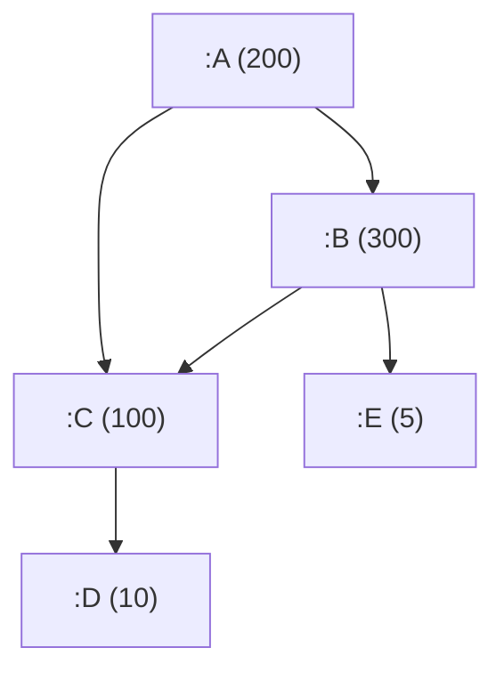

# Breadth-first Search

## Example Graph

Imagine we have a graph as this example:

```clojure
(def graph {:A {:children #{:B :C}
                :value 200}
            :B {:children #{:E :C}
                :value 300}
            :C {:children #{:D}
                :value 100}
            :D {:children #{}
                :value 10}
            :E {:children #{}
                :value 5}})
```



## Challenge

We want to count all the values in the graph without double counting from a given root element.

## Technique

We are opting to use a [Breadth-first search](https://en.wikipedia.org/wiki/Breadth-first_search) here, it will allow us to scan the graph level by level aggregating our answer (counting) as we go.

For this week's [Art Attack](https://en.wikipedia.org/wiki/Art_Attack) you will need:

- Recursion
- First in first out (FIFO) queue

Clojure has a built in FIFO queue that we are going to leverage, that can be invoked with **clojure.lang.PersistentQueue/EMPTY**


### Step 1 - The function arguments we will need

This function will require the example graph and we are also going to provide a root node to start the scan from:

```clojure
(defn breadth-first-search
  [graph root])

(breadth-first-search graph :A)
```

### Step 2 - Empty Queue

So lets start our function with an empty queue, and a pre-emptive loop because we are about to recursion recursion recursion:

```clojure
(defn breadth-first-search
  [graph root]
  (loop [to-process clojure.lang.PersistentQueue/EMPTY]))
```

### Step 3 - Put our root element into our processing list

To start processing our queue we will add the root element (the letter :A) to the queue right at the beginning using [conj](https://clojuredocs.org/clojure.core/conj):

```clojure
(...
  (loop [to-process (conj clojure.lang.PersistentQueue/Empty root)]))
```

### Step 4 - State we will need to maintain as we recur

Additionally we will need an **accumulator** to keep count of the value of each node as we travel the graph and an empty set called **seen**, this is required so we do not double count a node
Lastly we will benefit from knowing the current **letter** we are processing later on for fetching the current node and checking for whether we have seen this letter before.

```clojure
(...
  (loop [to-process ...
         accumulator 0
         seen #{}]
    (let [letter (peek to-process)])))
```

## Recap 

```clojure
(defn breadth-first-search
  [graph root]
  (loop [to-process (conj clojure.lang.PersistentQueue/EMPTY root)
         accumulator 0
         seen #{}]
    (let [letter (peek to-process)])))
```

So we have all the state we need to start doing operations, we will need three paths:

- Detect that the queue is empty and return the current accumulator, this will be our implementation's natural exit.
- Detect that we've seen this node before, remove the current letter from the queue and recur again.
- Process the current node, attempt to insert more items into the to process queue, update **seen** and recur again.

### Step 5 - Terminate recursion if we have no letters left

This will be how we stop our recursion, we can now return the answer:

```clojure
(...
  ...
  	...
  		(cond (nil? letter) accumulator)
```

### Step 6 - Skip node processing if we have seen this letter before

**Seen** is a set we can invoke it like a function on **letter** to determine if letter is inside the set:
If we have seen this letter then we go again, pop returns the queue but with the first element missing because we have no interest in processing this letter again:

```clojure
(...
  ...
  	...
  		(cond ... ...
            (seen letter) (recur (pop to-process) accumulator seen)))
```

### Step 7 -  Load up the queue, accumulate node value, add to what letters we have seen 👀

The core of our processing is here where we update our state:

- we must look up our current node add its value to our accumulator
- remove the current first letter from the queue because it is processed, then add the children node to the queue they will be processed left-to-right as we inserted them here
- Add that we have seen this letter now in our **seen**.

Once we have those three bits of state we can recur again:

```clojure
(...
  ...
  	...
  		(cond ...	...
            ... ...
            :else (let [node (graph letter)
                        accumulator (+ (:value node) accumulator)
                        to-process (into (pop to-process) (:children node))
                        seen (conj seen letter)]
                    (recur to-process accumulator seen))))
```

### All in one

```clojure
(def graph {:A {:children #{:B :C}
                :value 200}
            :B {:children #{:E :C}
                :value 300}
            :C {:children #{:D}
                :value 100}
            :D {:children #{}
                :value 10}
            :E {:children #{}
                :value 5}})

(defn breadth-first-search
  [graph root]
  (loop [to-process (conj clojure.lang.PersistentQueue/EMPTY root)
         accumulator 0
         seen #{}]
    (let [letter (peek to-process)]
      (cond (nil? letter) accumulator
            (seen letter) (recur (pop to-process) accumulator seen)
            :else (let [node (graph letter)
                        accumulator (+ (:value node) accumulator)
                        to-process (into (pop to-process) (:children node))
                        seen (conj seen letter)]
                    (recur to-process accumulator seen))))))


(breadth-first-search graph :A) ; => 615
```

Items in the graph will be scanned from the root, adding children elements into the queue left to right, each level will be fully processed and then the children of the far left element of the previous level will be scanned first, left to right again over and over until our exit condition.

